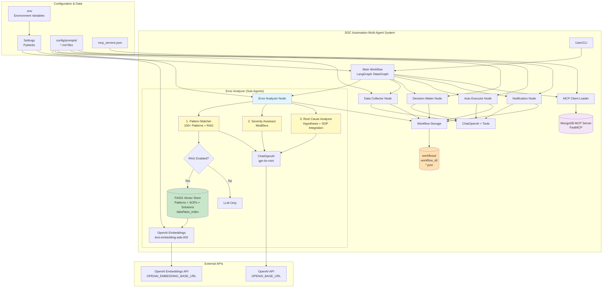
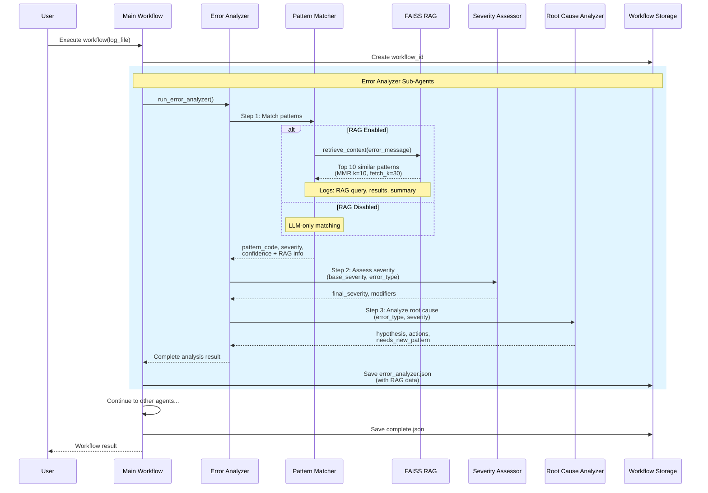
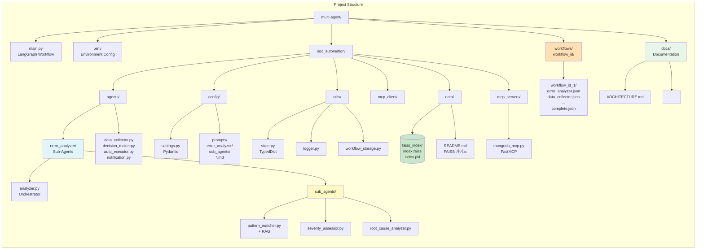
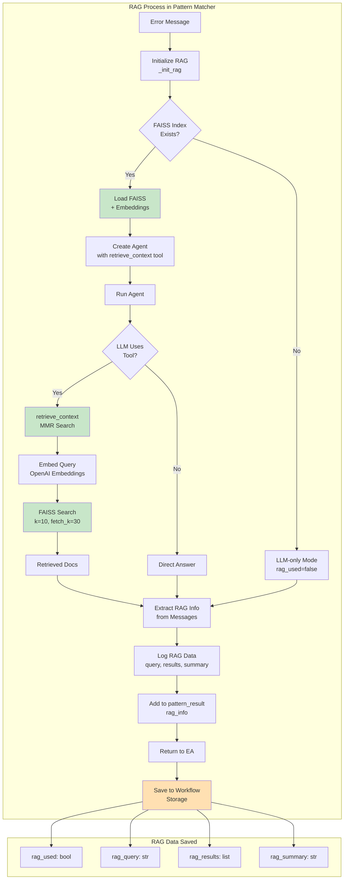

# SOC Automation Multi-Agent System - Architecture

이 문서는 SOC 검증 자동화 Multi-Agent 시스템의 전체 아키텍처를 설명합니다.

## 목차
- [시스템 개요](#시스템-개요)
- [전체 시스템 구조](#전체-시스템-구조)
- [데이터 흐름](#데이터-흐름)
- [프로젝트 구조](#프로젝트-구조)
- [RAG 프로세스](#rag-프로세스)
- [주요 컴포넌트](#주요-컴포넌트)

---

## 시스템 개요

SOC Automation Multi-Agent System은 LangGraph 기반의 워크플로우 오케스트레이션을 사용하여 5개의 전문화된 Agent가 순차적으로 실행되는 시스템입니다.

### 핵심 기능
- **에러 분석**: 3개 Sub-Agent를 통한 정교한 패턴 매칭 및 근본 원인 분석
- **RAG 기반 지식 검색**: FAISS vector store를 활용하여 에러 패턴, SOP, 과거 솔루션을 통합 검색
- **의사결정**: 자동 실행 가능 여부 판단
- **자동 실행**: 승인된 해결 방안 자동 실행
- **알림**: 작업 결과 통보

---

## 전체 시스템 구조



### 시스템 특징

1. **모듈화된 Agent 구조**
   - 각 Agent는 독립적으로 실행 및 테스트 가능
   - 명확한 책임 분리 (Separation of Concerns)

2. **Sub-Agent 패턴**
   - Error Analyzer는 3개의 전문화된 Sub-Agent로 구성
   - 각 Sub-Agent는 특정 작업에 최적화

3. **RAG 통합 지식 베이스**
   - FAISS vector store를 통한 의미론적 검색
   - 에러 패턴, SOP, 과거 솔루션을 통합 관리
   - Pattern Matcher가 검색, Root Cause Analyzer가 SOP 활용

4. **Workflow Storage**
   - 모든 실행 결과를 workflow_id별로 저장
   - 완전한 추적성 및 감사 가능

---

## 데이터 흐름



### 실행 단계

1. **초기화**
   - Workflow ID 생성
   - MCP 도구 로딩 (optional)
   - 초기 상태 생성

2. **Error Analyzer** (3 Sub-Agents 순차 실행)
   - Pattern Matcher: 에러 패턴 매칭 + RAG로 패턴/SOP/솔루션 검색
   - Severity Assessor: 심각도 재평가
   - Root Cause Analyzer: 근본 원인 분석 + SOP 기반 해결 방안 생성

3. **Data Collector**
   - 추가 로그 데이터 수집
   - 시스템 상태 정보 수집

4. **Decision Maker**
   - 해결 방안 결정
   - 자동 실행 가능 여부 판단
   - 리스크 평가

5. **Auto Executor** (조건부)
   - 자동 실행 승인된 경우에만 실행
   - 해결 방안 자동 적용
   - 롤백 계획 준비

6. **Notification**
   - 최종 결과 알림
   - Workflow 완료 표시

---

## 프로젝트 구조



### 디렉토리 설명

#### `/soc_automation/agents/`
Agent 구현 파일들
- `error_analyzer/`: 3개 Sub-Agent를 포함하는 Error Analyzer
  - `analyzer.py`: Orchestrator
  - `sub_agents/`: Pattern Matcher (RAG 통합), Severity Assessor, Root Cause Analyzer (SOP 활용)
- `data_collector.py`: 데이터 수집 Agent
- `decision_maker.py`: 의사결정 Agent
- `auto_executor.py`: 자동 실행 Agent
- `notification.py`: 알림 Agent

#### `/soc_automation/config/`
설정 및 프롬프트
- `settings.py`: Pydantic 기반 설정 관리
- `prompts/`: Agent별 프롬프트 MD 파일
  - `error_analyzer/sub_agents/`: Sub-Agent 프롬프트

#### `/soc_automation/utils/`
유틸리티 모듈
- `state.py`: TypedDict 기반 상태 정의
- `logger.py`: 로깅 설정
- `workflow_storage.py`: Workflow 결과 저장

#### `/soc_automation/data/`
데이터 파일
- `faiss_index/`: FAISS vector store
- `README.md`: FAISS 사용 가이드

#### `/soc_automation/mcp_servers/`
MCP 서버 구현
- `mongodb_mcp.py`: FastMCP 기반 MongoDB 서버

#### `/workflows/`
실행 결과 저장 (gitignore)
- `{workflow_id}/`: 각 workflow별 디렉토리
  - `error_analyzer.json`: Error Analyzer 결과 (RAG 정보 포함)
  - `data_collector.json`: Data Collector 결과
  - `decision_maker.json`: Decision Maker 결과
  - `auto_executor.json`: Auto Executor 결과
  - `notification.json`: Notification 결과
  - `complete.json`: 최종 결과
  - `summary.txt`: 요약

#### `/docs/`
프로젝트 문서
- `ARCHITECTURE.md`: 시스템 아키텍처 (이 문서)
- `BEGINNER_GUIDE.md`: 초보자 가이드
- 기타 문서

---

## RAG 프로세스



### RAG 상세 설명

#### 1. 초기화 단계
- `_init_rag()` 함수 호출
- FAISS index 존재 여부 확인
- OpenAI Embeddings 초기화
  - 별도 API URL 지원 (`OPENAI_EMBEDDING_BASE_URL`)
  - Fallback: `OPENAI_BASE_URL` 사용

#### 2. 검색 단계
- LLM이 `retrieve_context` 도구 사용 여부 결정
- 사용 시:
  - Error message를 embedding으로 변환
  - FAISS에서 MMR 검색 수행 (k=10, fetch_k=30)
  - 유사한 과거 패턴 반환

#### 3. 추출 및 저장 단계
- Agent 실행 결과에서 RAG 정보 추출
  - ToolMessage: 검색된 문서
  - AIMessage: 사용된 쿼리
- RAG 정보를 pattern_result에 포함
- Workflow Storage에 자동 저장

#### 4. 저장되는 RAG 데이터

```json
{
  "rag_used": true,
  "rag_query": "Cache coherency violation detected at address 0x1000",
  "rag_results": [
    {
      "source": {"file": "patterns/mem_errors.md", "line": 15},
      "content": "# MEM-001: Cache Coherency Violation..."
    },
    {
      "source": {"file": "sops/SOP-MEM-001.md", "line": 1},
      "content": "# SOP-MEM-001: Cache Coherency Resolution Steps..."
    },
    {
      "source": {"file": "solutions/issue-1234.md", "line": 1},
      "content": "# Solution: Cache coherency fix..."
    }
  ],
  "rag_summary": "Sources: patterns/mem_errors.md, sops/SOP-MEM-001.md, solutions/issue-1234.md"
}
```

**Note**: RAG는 에러 패턴, SOP 문서, 과거 솔루션을 모두 검색하여 반환합니다.

---

## 주요 컴포넌트

### 1. LangGraph Workflow

**역할**: 전체 워크플로우 오케스트레이션

**특징**:
- StateGraph 기반 상태 관리
- Conditional routing 지원
- MemorySaver를 통한 체크포인트

**주요 메서드**:
```python
workflow = StateGraph(AgentState)
workflow.add_node("error_analyzer", error_analyzer_node)
workflow.add_conditional_edges("decision_maker", decide_next_after_decision_maker)
app = workflow.compile(checkpointer=MemorySaver())
```

### 2. Error Analyzer Sub-Agents

#### Pattern Matcher
**역할**: 100+ 패턴 매칭 + RAG 통합 지식 검색

**특징**:
- FAISS vector store 통합 (패턴 + SOP + 솔루션)
- MMR 검색 (k=10, fetch_k=30)
- Graceful fallback (LLM-only)
- 에러 메시지로 관련 패턴, SOP, 과거 솔루션 검색

**반환값**:
```python
{
    "matched": bool,
    "pattern_code": str,
    "base_severity": int,
    "confidence": float,
    "rag_used": bool,
    "rag_results": list,  # 패턴 + SOP + 솔루션 포함
    "rag_query": str,
    "rag_summary": str
}
```

#### Severity Assessor
**역할**: 심각도 재평가

**특징**:
- 기본 심각도 + 모디파이어
- UNKNOWN 에러 특수 처리 (base=5, +1 penalty)

**반환값**:
```python
{
    "final_severity": int,
    "base_severity": int,
    "modifiers": list
}
```

#### Root Cause Analyzer
**역할**: 근본 원인 분석 + SOP 기반 해결 방안 생성

**특징**:
- 에러 타입별 분석 전략
- UNKNOWN 에러: 키워드 기반 검색
- RAG로 검색된 SOP 정보 활용
- SOP 절차와 근본 원인 가설 결합
- 자동화 가능한 단계 플래그 지정
- 새 패턴 제안

**반환값**:
```python
{
    "hypothesis": str,
    "confidence": float,
    "recommended_actions": list,  # SOP 기반 포함
    "needs_new_pattern": bool,
    "sop_references": list  # 사용된 SOP ID
}
```

### 3. Workflow Storage

**역할**: 실행 결과 저장

**저장 구조**:
```
workflows/
└── {workflow_id}/
    ├── error_analyzer.json      # RAG 정보 포함 (패턴 + SOP + 솔루션)
    ├── data_collector.json
    ├── decision_maker.json
    ├── auto_executor.json
    ├── notification.json
    ├── complete.json             # 최종 상태
    └── summary.txt               # 요약
```

**주요 메서드**:
```python
storage.save_step(workflow_id, step_name, data)
storage.save_complete(workflow_id, final_state)
```

### 4. MCP Integration

**역할**: Model Context Protocol 서버 통합

**특징**:
- MongoDB MCP Server (FastMCP)
- 동적 도구 로딩
- Resources 및 Tools 제공

**제공 도구**:
- `find()`: MongoDB 쿼리
- `insert_one()`: 문서 삽입
- `aggregate()`: Aggregation (read-only)

### 5. Settings Management

**역할**: 환경 변수 및 설정 관리

**특징**:
- Pydantic 기반 타입 검증
- 계층적 설정 구조
- 환경 변수 자동 로딩

**주요 설정**:
```python
class OpenAISettings:
    api_key: str
    base_url: Optional[str]
    model: str
    temperature: float
```

---

## 환경 변수

### 필수 환경 변수

```bash
# OpenAI API
OPENAI_API_KEY=sk-your-api-key-here
OPENAI_MODEL=gpt-4o-mini
OPENAI_EMBEDDING_MODEL=text-embedding-ada-002

# MongoDB
MONGODB_URI=mongodb://localhost:27017
MONGODB_DB=soc_db

# Paths
LOG_DIR=/var/log/sim
SOP_DIR=/opt/sop
```

### 선택적 환경 변수

```bash
# Custom API URLs
OPENAI_BASE_URL=https://your-llm-api.com/v1
OPENAI_EMBEDDING_BASE_URL=https://your-embedding-api.com/v1

# Agent Configuration
AGENT_MAX_ITERATIONS=10
AGENT_TIMEOUT_SECONDS=300
```

---

## 실행 방법

### 전체 Workflow 실행

```bash
uv run python main.py /path/to/log/file.log
```

### Error Analyzer 단독 실행

```bash
uv run python -m soc_automation.agents.error_analyzer.analyzer
```

### Pattern Matcher 테스트

```bash
uv run python -m soc_automation.agents.error_analyzer.sub_agents.pattern_matcher
```

---

## 성능 최적화

### RAG 성능

1. **FAISS Index 크기**: < 100K 문서 권장
2. **Chunk Size**: 패턴 문서 길이에 맞게 조정 (기본 1000)
3. **MMR Parameters**:
   - `k=10`: 최종 반환 문서 수
   - `fetch_k=30`: 초기 검색 문서 수

### LLM 호출 최적화

1. **모델 선택**: `gpt-4o-mini` (속도/비용 균형)
2. **Temperature**: 0.7 (일관성과 창의성 균형)
3. **병렬 처리**: MCP 도구 병렬 로딩

---

## 확장 가능성

### 새 Agent 추가

1. `soc_automation/agents/` 에 Agent 파일 생성
2. `config/prompts/` 에 프롬프트 MD 파일 추가
3. `main.py`의 workflow에 노드 추가
4. 상태 업데이트 함수 구현

### 새 Sub-Agent 추가

1. `error_analyzer/sub_agents/` 에 파일 생성
2. `config/prompts/error_analyzer/sub_agents/` 에 프롬프트 추가
3. `analyzer.py`에서 호출

### 새 패턴 추가

1. `config/prompts/error_analyzer/sub_agents/pattern_matcher.md` 수정
2. FAISS index 재생성 (선택사항)

---

## 트러블슈팅

### RAG 관련

**Q: "FAISS index not found" 경고**
- `soc_automation/data/faiss_index/` 경로 확인
- Index 파일 (`index.faiss`, `index.pkl`) 존재 확인

**Q: RAG가 사용되지 않음**
- FAISS index가 올바르게 로드되었는지 로그 확인
- LLM이 `retrieve_context` 도구를 사용하지 않기로 결정했을 수 있음

### Workflow 관련

**Q: Agent 실행 실패**
- 로그 파일 확인: `logs/{workflow_id}.log`
- 환경 변수 설정 확인
- API 키 유효성 확인

**Q: MCP 도구 로딩 실패**
- `mcp_servers.json` 설정 확인
- MongoDB 연결 확인
- `--no-mcp` 플래그로 MCP 없이 실행 가능

---

## 참고 문서

- [BEGINNER_GUIDE.md](../BEGINNER_GUIDE.md): 초보자를 위한 가이드
- [data/README.md](../soc_automation/data/README.md): FAISS RAG 설정 가이드
- [LangGraph Documentation](https://langchain-ai.github.io/langgraph/)
- [LangChain Documentation](https://python.langchain.com/)

---

## 버전 정보

- **LangChain**: v0.2+
- **LangGraph**: v1.0.5+
- **Python**: 3.10+
- **FAISS**: langchain-community
- **FastMCP**: 최신 버전

---

## 라이선스

이 프로젝트의 라이선스 정보는 프로젝트 루트의 LICENSE 파일을 참조하세요.
